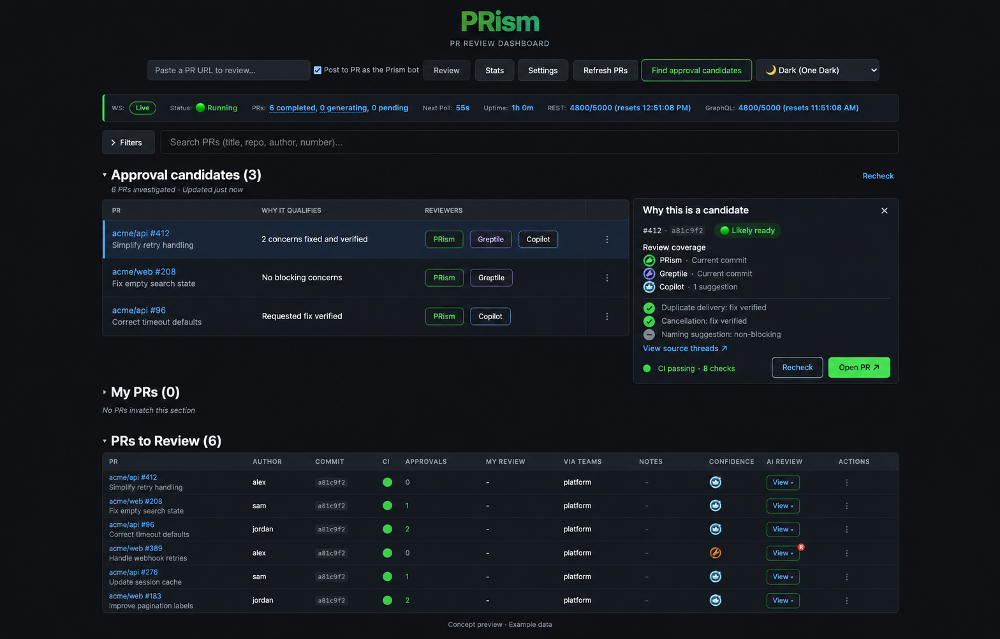

# Approval candidates: implementation specification

Status: frozen v1, including the final consistency-audit resolutions. Implementation is organized as a six-part draft PR stack.
Date: 2026-09-28. Planning baseline: `9037294`. Implementation baseline: `7df6ee8` (current mainline at kickoff).

## 1. Product contract

Let a user request a shortlist of PRs that probably warrant a quick approval. Investigate existing reviews, verify how concerns were addressed, and explain each recommendation with linked evidence. The recommendation means that the collected review evidence supports a quick human approval decision for a particular revision. It does not submit an approval or certify mergeability.

The approved visual direction is the existing centered header and compact dark tables, with a new trigger, candidate section, and evidence panel:



The image establishes layout and styling. The states, wording and contracts below govern implementation where the illustrative image is ambiguous.

### Fixed scope

- A manual, user-scoped background scan started from the dashboard.
- PRism, Greptile and GitHub Copilot evidence, including summaries, reviews, inline comments and replies when present.
- Human objections and GitHub check state as additional constraints.
- A bounded read-only investigator that can inspect the relevant code, diffs and review evidence.
- Persisted, explainable results, per-PR recheck, cancellation, freshness and partial failure handling.
- SQLite and PostgreSQL support, consistent with the current application.

### Excluded from v1

Automatic approval, merging, posting comments, resolving threads, triggering any provider's review, fixing code, executing tests, arbitrary web browsing, historical reviewer prediction, numeric approval probabilities, cross-user recommendation sharing, new Greptile/Copilot credentials, and background model runs caused only by a GitHub event. The UI does not expose model or budget tuning. Normal PRism reviews remain independent.

## 2. User workflow and UI

### Start a scan

Place **Find approval candidates** beside **Refresh PRs** in `Header.tsx`. It opens a small inline launch panel stating **Investigate N PRs** and showing the captured scope. This is the explicit cost-bearing action; opening the panel does not invoke a model.

Scope is the current top-level search, repository, team and state filters applied to the user's visible PR inventory. Exclude the user's own PRs, hidden PRs, drafts, closed/merged PRs, and PRs whose user's latest standing approval is for the current HEAD. An approval on an older commit does not exclude a PR. Include manually requested PRs when they otherwise qualify. Section names, collapsed sections and custom section ordering do not determine membership. The same PR appearing in multiple sections is included once. The browser excludes an approval only when its revision is known to equal HEAD. Add optional `my_review_commit_sha` to the user-specific PR response, derived from actual review metadata rather than the PR's current SHA. Until that value is known, retain the target in the launch pool and let admission resolve its eligibility.

Freeze the explicit target list when the user starts. The server rechecks membership and eligibility rather than trusting client filters or supplied identities. Changing filters during a scan changes what is displayed, not what is running. Show the original scope and a count of results hidden by current filters. Zero eligible PRs disables Investigate and explains why. A scan above the configured target limit asks the user to narrow filters; it does not silently sample.

While active, the header action becomes **View investigation**. Show queued/running progress, terminal count, candidate count and **Cancel remaining**. Cancellation does not erase completed results. Closing the panel, navigating away, refreshing the page or closing the browser does not cancel the server job. Restore the user's active scan, latest `kind=full` scan and current per-PR results on return. A single-PR recheck replaces only that PR's current result, not the rest of the shortlist. V1 permits one active scan of either kind per user. While it is queued, running or cancelling, disable Recheck with **Investigation already running** and link to that scan; the API returns 409 with its ID. Full-section Recheck opens the launch panel with the current filters, so it does not silently reuse an obsolete scope.

The collapsed bar retains a prism animation, a finished-target count and an activity line of at most ten words. Poll aggregate progress every two seconds without GitHub reads; refresh evidence lists every ten seconds. Fill tracks finished targets, including failures, and never implies estimated time remaining. Respect reduced-motion preferences. Workers report only observed stages and tool names. Optional Flash-Lite summaries refresh at most every ten seconds when activity changes, with a deterministic fallback, a four-second timeout and at most 18 calls of 64 output tokens per target attempt. These presentation calls are separate from investigation reservations and cannot influence assessments. They receive no source content, tool arguments or model reasoning.

### Results

Insert a fixed **Approval candidates (N)** section below the global filters and above configurable PR sections. Keep the existing needs-re-review pin in its current position. Do not migrate or reset the user's section preferences. Candidate PRs continue to appear in their normal sections, as in the approved mockup.

Rows contain PR identity and title, a short reason, provider chips, and an explicit **View evidence** action. Provider chips indicate evidence availability, not votes. Sort candidates by existing newest-first PR ordering; do not invent a risk score. The section uses the latest admitted target for each user/PR across retained scans, filtered by the current view. The progress subline explicitly refers to the selected scan; its totals are not presented as totals for all historical results. Show **Other results** collapsed beneath the shortlist, with needs-attention, insufficient-evidence, stale, excluded and failed counts.

A selected row opens the integrated evidence panel shown in the mockup. It contains:

- PR identity, assessed commit, assessment time and last evidence validation time.
- Recommendation and concise rationale.
- Each provider's identity, reviewed revision, completion state and coverage limitations.
- Every substantive concern, its disposition, rationale and source references. Mark investigator conclusions as **Agent assessment**.
- Code citations for claims that a fix was verified; review/thread links for provenance.
- CI and human-review blockers, missing evidence and known limitations.
- **Recheck** and **Open PR**. No Approve or Merge control.

Use **Fix supported by code inspection**, not wording that implies execution of tests. A source without a known reviewed revision is labeled **Commit unknown**, never **Current commit**. Missing Copilot evidence is **Not observed**, not a positive review or necessarily a failed integration.

### Required presentation states

| State | Presentation |
| --- | --- |
| Never scanned | Brief explanation and Investigate action; no empty green success state |
| Queued/collecting/investigating | Stage and counts; no fabricated percentage or ETA |
| Partial results | Show completed candidates, explicitly mark investigation still running |
| Completed with candidates | Candidate rows and expandable other results |
| Completed with none | Distinguish blockers from insufficient evidence |
| Source/API/model failure | Per-PR reason and Recheck; successful results survive |
| Stale | Remove positive candidate styling and count; retain explanation as historical |
| Cancelled | Show completed results and how many were cancelled |
| Unavailable runtime | Disable start with a concise availability reason |

Desktop uses the adjacent evidence panel. Narrow layouts put evidence below the selected row. Use semantic tables, text labels in addition to colors, keyboard-operable selection, Escape to close, restored focus, and polite progress announcements. All colors use existing theme tokens. Read-only API polling is sufficient for v1; no new websocket delivery path is required.

## 3. Recommendation policy

The server owns eligibility. The investigator supplies structured evidence assessments and can decline to decide; it cannot override deterministic gates.

### Separate dimensions

Task execution state is independent from recommendation:

- Execution: `queued`, `collecting`, `investigating`, `validating`, `completed`, `failed`, `timed_out`, `cancelled`.
- Decision on a completed assessment: `candidate`, `needs_attention`, `insufficient_evidence`, `excluded`.
- Freshness: `current`, `stale`, `expired`.

A failed or timed-out task has no positive decision. Other-results buckets are mutually exclusive in this order: failed/timed_out/cancelled execution; stale/expired freshness; needs_attention; insufficient_evidence; excluded. A historical candidate that is stale appears only in the stale bucket. A stale historical candidate is not an active candidate.

### Candidate gates

All must pass:

1. The target remains visible to the requesting user, open, non-draft, non-owned, non-hidden and not already approved by that user at the current HEAD. A later COMMENTED review does not replace a standing opinionated review; dismissal does. Unknown approval revision is not treated as an exact-HEAD approval.
2. Collection is complete within explicit limits, with no unhandled API failures, truncated required inputs or unrecognized substantive review artifacts.
3. At least one trusted provider has a completed, revision-attributed review of the current HEAD, with no known interrupted or omitted review input. Optional providers may be absent. Mere comments, a passing check, a confidence score, or an overview's optimistic wording do not establish review completion.
4. Every substantive concern from collected AI and human review evidence has a supported disposition. Unresolved concerns, material disagreement or uncertain classification exclude the PR from candidates.
5. No active human `CHANGES_REQUESTED` review remains. Derive standing opinionated decisions using fully collected authoritative review/dismissal metadata, not the current dashboard's latest-comment reduction. The investigator cannot dismiss a human review. Disagreement about whether a human request is obsolete requires human re-review.
6. CI for this HEAD is positive and complete: at least one successful check/status, no failing, pending, cancelled, timed-out or action-required latest check. Neutral/skipped checks are displayed but do not themselves establish success. No checks or unknown CI is insufficient evidence. Required-rule compliance is not asserted.
7. The investigator completed its concern ledger and returned valid, source-backed output with no unresolved coverage gaps.
8. Final evidence revalidation still matches the assessed snapshot, and the result is within its freshness window.

A known blocker yields `needs_attention`, with any evidence gaps also reported. In the absence of a known blocker, missing/incomplete evidence yields `insufficient_evidence`. Metadata-based scope exclusion yields `excluded`. None is silently converted into approval.

A detected current-HEAD provider review that is still queued/running, or has an outstanding review request whose completion cannot be established, defers candidacy with `review_in_progress`; the scan does not wait indefinitely or start another review. A later failed run is shown separately and never rewrites an older completed artifact. Any known incompleteness of the selected evidence remains a gate failure.

A completed review is not a proof that every line was examined. Record review execution completion separately from reported file coverage (`reported_complete`, `reported_partial`, `not_reported`). `reported_partial` cannot supply the sole current-HEAD review. A normal successful run with unreported per-file coverage can supply it, but the panel says **File coverage not reported**. Do not invent coverage counts. Known timeout, skipped input, malformed artifacts or unsupported completion formats cannot be treated as a normal completed run. Known model fallback is recorded and accepted only when the effective policy explicitly permits that actual model.

### Revision policy

V1 requires at least one completed current-HEAD provider review. A code-inspected delta after an old review does not substitute for this gate. Older reviews remain relevant sources of concerns, which the investigator can check against current code. A fresh PRism review may provide coverage while older Greptile concerns are reconciled; Greptile is still labeled with its actual reviewed revision.

This avoids a new general-purpose incremental review engine. Base commit, merge base and head commit are captured separately. Base changes invalidate the assessment even when HEAD remains unchanged. Re-running the investigation on the new base may qualify using current-HEAD review evidence and fresh code inspection; the UI must not claim that an external provider reviewed a particular base unless its evidence establishes that.

### Concern dispositions

Use `fixed`, `not_applicable`, `non_blocking`, `unresolved`, `uncertain`. Preserve original provider severity separately from normalized impact.

- `fixed`: explain the original failure condition, the relevant code change and why the current code addresses it, with precise revision/file/line references.
- `not_applicable`: cite contradictory code or explicit requirements, not only an author's assertion.
- `non_blocking`: a supported style/documentation suggestion with no material correctness concern. Low severity alone does not establish this.
- `unresolved` or `uncertain`: prevents candidacy for substantive issues.

For `fixed`, cite relevant changed code relative to the concern's revision as well as current behavior. If the original revision is unknown or the asserted fix has no supporting change, use another justified disposition or `uncertain`. A location existing on disk is not proof.

A thread resolution, deleted comment, acknowledgment, thumbs-down reaction, author saying "fixed", or a subsequent review omitting an old concern is not evidence that the concern was fixed. Existing finding outcomes are context, not automatic overrides. Deduplication groups equivalent concerns without discarding any provider's provenance; uncertain duplicates stay separate. A higher score never cancels a concrete concern.

## 4. Evidence collection and normalization

### Collector boundary

Trusted server code fetches GitHub and PRism data. The model gets a frozen evidence snapshot through narrow tools. The model cannot choose arbitrary repositories, API URLs or credentials. Required reads include PR details and review requests; all pages of reviews, issue comments, inline threads and nested replies; current-head checks/statuses; relevant durable PRism runs and sidecars; and source/diff data for pinned revisions.

Existing GitHub summaries are insufficient: `ListReviews` fetches only one page; current comment DTOs omit some revision/update/thread fields; batched review reductions do not preserve the complete discussion. Add a dedicated collector rather than treating dashboard counts as canonical evidence. Any pagination or GraphQL partial failure affecting required evidence marks collection incomplete.

### Canonical schema

| Object | Required data |
| --- | --- |
| `TargetSnapshot` | Repository numeric/node identity and installation/access partition, PR number, head/base/merge-base SHAs, open/draft/author state, current user's review state, capture times |
| `SourceIdentity` | Provider kind, actor numeric/node ID, actor type/login, app identity where available, verification method, adapter version |
| `ReviewEvidence` | Stable evidence ID, source identity, artifact kind and remote ID, parent review/thread/run ID, created/updated times, body digest, source URL, original/current reviewed SHA or unknown, completion and coverage state |
| `Concern` | Stable local ID, source evidence IDs, original severity, normalized impact, quoted claim or bounded excerpt, file/line anchors, resolution metadata, investigator disposition and rationale |
| `Citation` | Evidence ID or pinned repository blob SHA/path/line span; exact excerpt or digest; server validation result |
| `CollectionManifest` | Per-endpoint completion, pagination counts, errors/truncations, adapter versions, total bytes, snapshot digest |
| `Assessment` | Schema/policy/prompt/runtime versions, task and snapshot IDs, disposition for every concern, rationale, coverage gaps, citations, model provenance and timing/budget metadata |

Store immutable snapshots and assessments as protected data. Render escaped text; source links must be collector-owned GitHub URLs or authenticated PRism routes. Do not accept arbitrary model-generated URLs or HTML.

### Provider adapters

**PRism:** Read retained durable run history for the target PR with pagination, including lifecycle metadata, and completed runs' immutable sidecars by full SHA and run ID. Bound the history using the same explicit collection ceilings; do not silently discard older substantive concerns. Preserve run configuration, completion, findings, required checks, model fallback and serving-model verification. Mutable PR counts, latest artifact aliases and an absent finding count are not completion evidence. Publication to GitHub is irrelevant to eligibility. Retain earlier substantive concerns until they have supported dispositions.

**Greptile:** Collect authentic review objects, inline discussions and general comments, including edits to an existing summary. The author's PR body may contain a purported summary but is untrusted supporting text unless independently corroborated. Do not hardcode a `5/5` regex as the approval decision. Revision association and completeness require adapter-supported evidence, not timestamp proximity alone.

**Copilot:** Collect authentic reviews and comments, including overview assessments and explicit GitHub review states when available. Preserve both `COMMENTED` and `APPROVED` semantics. Neither missing comments nor the presence of a coding-agent commit proves code-review completion. A review may be stale after new pushes.

Bot/provider recognition uses exact verified actor IDs and app identity where exposed, resolved from an operator-owned allowlist. Display-name substrings, body branding and author-written markers are not sufficient. No provider identity numbers are invented in source. Production identities and fixture expectations are verified during adapter integration. Unrecognized automation remains generic evidence and cannot supply trusted review coverage. REST and GraphQL may spell the same bot login differently; normalize by verified actor identity, not by blindly rejecting or accepting the suffix. Never discard a possible substantive concern just because its source is not a trusted coverage provider.

Create an inventory entry for every collected review artifact. Parsers may extract structured concerns, but parse failure must preserve the original artifact. The investigator must classify each remaining artifact as concerns or non-actionable with a rationale; all extracted concern IDs then require dispositions. Reconcile provider-stated counts with collected items where available. Unsupported or ambiguous summaries remain a coverage gap. Keep PRism SUMMARY/CHECK entries and bot request-changes verdicts as decision evidence; do not silently omit them because they are not source-file findings. Concern IDs include immutable run/artifact identity; a drifting cross-run fingerprint is not a unique primary key.

### Provider documentation verification

GitHub documents that Copilot defaults to comment reviews but can submit approvals when enabled, and includes an overview assessment. An overview assessment and an actual approval are separate evidence. Re-review after pushes depends on configuration. [GitHub Copilot documentation](https://docs.github.com/en/copilot/how-tos/use-copilot-agents/request-a-code-review/use-code-review).

Greptile's published workflow describes edited-in-place summary comments and actionable summary content beyond inline comments. Collect body hashes and update times, including summary-only concerns. That workflow is documentation evidence; this feature never runs its mutation steps. [Greptile's maintained workflow](https://github.com/greptileai/skills/blob/main/greploop/SKILL.md).

Raw field and pagination contracts must be tested against the [GitHub review API](https://docs.github.com/en/rest/pulls/reviews?apiVersion=2022-11-28) and [GraphQL pull request types](https://docs.github.com/en/graphql/reference/pulls). Provider prose is versioned adapter input, not a stable external schema.

## 5. Investigation runtime and tools

Run a bounded tool-calling loop in Go, independently of the browser and ordinary review publication jobs. The model returns structured tool requests; Go validates and executes only the registered read functions, then returns bounded results. The model is never a local process with filesystem or shell access. No MCP server or model CLI subprocess is needed for v1. Never call `ProcessReviewImmediate`, a publishing callback, or the existing review pipeline to implement a candidate scan.

Implement a dedicated context-aware `InvestigatorClient` interface with native Anthropic and OpenRouter API adapters. Reuse the existing Anthropic SDK and HTTP client patterns, not the single-shot `GetReview` contract, which lacks the needed conversation/tool/cancellation semantics. The first integration milestone proves Anthropic; the OpenRouter adapter must pass the same conformance tests before being reported available. Both use the identical Go dispatcher and result schema. Existing Claude Code and Codex CLI backends are not used for this task.

Require operator configuration `APPROVAL_CANDIDATES_PROVIDER` (`anthropic` or `openrouter`) and `APPROVAL_CANDIDATES_MODEL` when enabling the feature. Reuse the deployment's corresponding API credential. Validate tool support and fail closed if the configured route cannot support it. No automatic provider/model fallback or inference from an unrelated review-agent setting. Claude subscription authentication alone is insufficient for this native API design; capabilities must explain a missing API credential. This is a deployment prerequisite, not a prompt for users to supply keys.

Client tool execution in the application follows the providers' documented interfaces: [Anthropic tool use](https://platform.claude.com/docs/en/agents-and-tools/tool-use/overview) and [OpenRouter tool calling](https://openrouter.ai/docs/guides/features/tool-calling). Only custom application tools are registered, with no provider-hosted browser, search, code-execution or computer tools.

### Allowed tool contract

| Tool | Inputs | Enforcement |
| --- | --- | --- |
| `list_evidence` | Snapshot-local kind and cursor | Immutable, bounded, complete manifest visible |
| `read_evidence` | Snapshot evidence ID | No arbitrary URL or cross-task IDs |
| `list_files` | Allowed revision and path prefix | Only pinned repository trees |
| `read_file` | Allowed revision, relative path, line span | Bounds, binary/size checks; no host paths |
| `search_code` | Allowed revision, literal text, path scope, cursor | Bounded search over tracked blobs; no executable arguments |
| `read_diff` | Allowed revision pair and optional path | Server-owned git operation; no external diff driver |

The Go tool dispatcher operates on snapshot data and pinned git blobs. Do not expose the host filesystem through generic Read/Grep/Glob or a worktree path. Reject absolute paths, traversal, unregistered revisions, symlink escapes, submodule traversal and arbitrary object/URL access. Repository hooks, checkout filters, external git diff/textconv, package scripts and LFS execution are disabled. Trusted host code may run constrained git operations; the agent cannot supply shell commands.

There are no registered shell, file-write, host-filesystem-read, browser, web, delegation or mutation tools. Unknown tool names and out-of-scope parameters are rejected. The model cannot register additional tools. GitHub, database, artifact and model credentials remain inside their respective server clients and never enter prompts or tool results. Repository instructions, hooks, skills and MCP settings are read only as source text if relevant; none is executed or installed.

Use a private approval-investigation git object cache rather than sharing writable cache configuration with existing CLI review agents. Pin and retain allowed commits for the target lifetime. Ignore global/system git configuration, clear inherited git environment overrides, use validated executable arguments and disable hooks, credential helpers, filters, external diff/textconv and submodule recursion. Authenticate fetches through the existing server credential interface without putting credentials in model-visible data, command logs or process arguments. This hardening is limited to the new cache/reader path.

Current `argsWithTools` only applies its tool list to Claude; the Codex path retains shell access under a read-only filesystem sandbox. The native loop avoids depending on those different CLI permissions. This is a task-specific runtime choice, not a request to redesign existing PRism review execution.

Treat repository text, comments, summaries and quoted instructions as untrusted data. Output must match a strict schema. Server validation rejects missing concern decisions, unknown evidence IDs, fabricated paths or line spans, claims of executed tests, and attempted tool escalation. Structural validation establishes traceability, not mathematical correctness of the investigator's reasoning.

## 6. Persistence and worker lifecycle

Use dedicated scan tables and a separate worker dispatcher in the existing Go service. Do not add candidate fields to mutable review results or reuse review publication ownership. Factor small reusable lease/checkout helpers where useful; avoid refactoring the whole review pipeline.

### Records

- `approval_scans`: opaque ID, requesting user, `kind` (`full` or `recheck`), captured filter/scope JSON, schema/policy/runtime snapshot, idempotency hash, timestamps, status and cancellation request.
- `approval_scan_targets`: scan/PR identity, expected and observed revisions, monotonic request generation, execution stage, immutable evidence/assessment references, decision/reasons, freshness times, worker lease/attempt, error and resource metadata.
- `approval_evidence_snapshots`: protected canonical JSON plus manifest/digest and target identities.
- `approval_assessments`: immutable structured result plus provenance and citations. Target points to its completed result.

Operational persistence also covers database-backed slot leases, generation-bound revalidation leases and daily token reservations/usage. These records participate in the same claim/recovery/finalization transactions; an in-memory counter cannot enforce a deployment-wide cap.

Do not cascade away historical scan records when the normal PR row is pruned. Duplicate target identity fields. Access is still checked before historical details are served. Add `approval_user_targets`, a small projection keyed by user/repository ID/PR number with latest target ID and generation. Advance it atomically on admission, invalidating an older active recommendation immediately. A monotonic user/PR generation fences replacement results, so an older scan finishing late cannot replace a newer recheck in the user's shortlist. Older execution records may still finalize as historical results, but cannot become the active projection.

### Execution

1. Authenticate, enforce feature availability and target limits, validate explicit user-visible targets, and persist scan plus queued targets in one transaction.
2. Dispatcher claims targets with a durable holder ID, attempt and expiring lease. Reserve a bounded runtime slot before beginning the expensive stage. Use transactional database-backed slot/lease reservations for deployment-wide and per-user concurrency, not per-process semaphores alone. Active-scan uniqueness includes `cancelling` until all remaining work is fenced and settled.
3. Recheck authorization and live PR state; collect complete evidence and pin revisions. Targets that move after admission finalize as execution `completed`, decision `insufficient_evidence`, reason `head_changed`, freshness `stale`, rather than silently switching commits. Targets that become ineligible after admission finalize `completed`/`excluded` with a reason.
4. Apply deterministic blockers. Blocked/excluded targets can finish without a model call, retaining useful reasons and collection limitations.
5. Invoke the investigator when evidence supports meaningful evaluation. Validate structured output and citations.
6. Re-fetch relevant evidence and metadata. If the content/revision digest changed, produce a stale result, never publish an active candidate for the old snapshot.
7. Atomically finalize only if holder, attempt, lease and cancellation still permit it. Advance the active result only when the user/PR generation is still current. Update scan progress from durable child states.
8. Clean up temporary files and expire retained records on schedule.

Parent scan states are `queued`, `running`, `cancelling`, followed by terminal `completed`, `partial`, `failed`, `cancelled`. Compute a terminal parent status only after every child is terminal; otherwise it remains queued/running/cancelling. Parent status precedence is: `cancelled` if cancellation was requested; otherwise `failed` if no child completed; otherwise `partial` if any child failed or timed out; otherwise `completed`. Completed children with stale, insufficient or excluded decisions count as normally completed tasks, not task failures. No child becomes cancelled without parent cancellation in v1. Completion does not mean any PR qualified. Cancellation preserves already completed children. A cancel request immediately fences new positive finalizations and queued claims; workers cancel HTTP requests and tool operations and release resources. Check cancellation between calls and on a five-second control tick during in-flight requests; normal cancellation settles within ten seconds, with lease recovery covering an unreachable worker.

Lease expiry permits at most one recovery attempt. A new holder must not extend the target's absolute deadline or total budget. Old holders cannot finalize. Restart reconciliation resumes queued work, recovers eligible expired leases, and settles exhausted jobs. Transient read failures get bounded retries; deterministic parsing, identity, authorization and capability failures do not trigger model retry loops.

### Initial operator defaults

| Limit | Default |
| --- | --- |
| Feature flag | `APPROVAL_CANDIDATES_ENABLED=false` |
| Targets per scan | 50 |
| Active scans per user | 1 total across full scans and rechecks |
| Concurrent investigators | 4 deployment-wide, all usable by one user (the scan deadline assumes it); idle workers claim at most every 5 seconds |
| Target active deadline | 8 minutes, including collection and final validation; the answer is requested 3 minutes before it; 4 targets run at once |
| Scan deadline | Target count × 8 minutes / 4 slots + 8 minutes + 10 minutes queue allowance from acceptance; about 118 minutes for 50 targets |
| Investigator tool calls | 40 per target across recovery attempts |
| Model rounds | 16 per target across recovery attempts |
| Token ceilings | At most 100,000 input tokens per call; 600,000 aggregate input and 12,000 aggregate output per target |
| Daily model budget | Optional operator-set input/output token caps per UTC day; unset means unlimited |
| Execution attempts | 1 normal, at most 1 interrupted-worker recovery |
| Lease / heartbeat | 60 seconds / 15 seconds |
| Poll active scan | Aggregate progress every 2 seconds; evidence lists every 10 seconds; back off on errors/hidden tab |
| Positive-result validation window | 5 minutes |
| Full scan/evidence retention | 30 days |

Resource ceilings are deployment-owned, snapshotted at admission, and enforced across replicas. The 8-minute target clock begins when execution and its slot are acquired, not at enqueue. The scan deadline still bounds queue starvation; targets that cannot start before it expire with `queue_deadline`.

Collector defaults are 2,000 review/discussion artifacts, 500 changed files, 2 MiB of aggregate diff, and 8 MiB of evidence text per target. Read tools return at most 64 KiB or 400 lines per call, searches at most 200 matches with explicit cursors, and at most 1 MiB of cumulative tool-result text per target. Counts include nested replies and general summaries. Exceeding any required-input limit produces `insufficient_evidence`, never silent truncation. Unread optional search pages are not themselves missing review evidence; unfinished required artifact/concern classification is.

Keep candidate investigation capacity separate from ordinary reviews. `APPROVAL_CANDIDATES_DAILY_INPUT_TOKENS` and `APPROVAL_CANDIDATES_DAILY_OUTPUT_TOKENS` are optional; unset means no daily cap, and a set cap must admit at least one full target allowance. Usage is recorded per UTC day either way. Reserve a target's remaining maximum token allowance atomically against the current UTC day before its first model call, keep that reservation through recovery, and release unused tokens at terminal completion. Reservations do not reset for an in-flight target at midnight; new targets reserve against the new day. When remaining daily capacity cannot admit a target, no model call starts: it fails with `budget_exhausted`. Already reserved running targets continue within their allowance. New scan admissions return 429 with the UTC-reset Retry-After when no target can be admitted. Count reported cache-read tokens in aggregate input; the limits are resource ceilings, not dollar estimates.

Persist round/tool/token consumption across recovery; reserve each next call's allowance before issuing it. Never interpret a provider stop caused by a budget cap as successful completion. If usage is missing after an interrupted request, conservatively charge the reserved allowance.

## 7. API, authorization and freshness

### Endpoints

All routes use existing authenticated JSON API conventions and return `Cache-Control: no-store`.

| Endpoint | Contract |
| --- | --- |
| `GET /api/v1/approval-capabilities` | Enabled/available, supported runtime, limits and concise unavailable reason; no secrets |
| `GET /api/v1/approval-scans/{scan_id}/progress` | Owner-scoped aggregate counts and activity label, without target identities or evidence; no GitHub/model calls |
| `POST /api/v1/approval-scans` | Explicit targets with full expected HEADs plus scope description; caller-scoped Idempotency-Key; returns 202 and Location |
| `GET /api/v1/approval-candidates?limit=...&cursor=...` | Current user/PR projections, freshness and links to source scan/target; each result has one latest generation |
| `GET /api/v1/approval-scans?kind=...&limit=...&cursor=...` | Requesting user's scans, newest first |
| `GET /api/v1/approval-scans/{id}` | Lifecycle, captured scope, counts and paginated targets |
| `GET /api/v1/approval-scans/{id}/targets/{target_id}` | Authorized target result, evidence summary and citations |
| `POST /api/v1/approval-candidates/revalidate` | Explicit read-only-evidence refresh for bounded visible target IDs; deduplicated by user/PR/generation; no model calls |
| `POST /api/v1/approval-scans/{id}/cancel` | Idempotently fence remaining work |
| `POST /api/v1/approval-scans/{id}/targets/{target_id}/recheck` | Create a new single-target scan against explicitly supplied current HEAD; return new scan/target identity |

Scan responses include `kind`. Results use `scan_id`, `target_id`, `revision`, `execution_status`, `decision`, `freshness`, `reason_codes`, `summary`, `sources`, `concerns`, `checked_at`, `validated_at`, `valid_until`. No terminal result is represented only by free text. Progress includes total/queued/running/completed/failed/timed_out/cancelled. `running` aggregates collecting, investigating and validating; `completed` includes all four completed decisions. These execution buckets sum to total. Candidate count is a separate subset of completed results that remain current and eligible. A known-stale target discovered before any assessment completes with `insufficient_evidence` and `head_changed`, rather than inventing an assessment for another revision.

Validate request size and target count; reject unknown fields. Identical idempotency replay returns the original scan; reused keys with different canonical bodies return 409. Active-scan conflicts return 409 with the existing scan ID. Inaccessible targets return 404 without leaking existence. Admission is atomic for inaccessible, malformed and expected-HEAD-mismatch errors; no tasks are created on those errors. Accessible targets that are now self-authored, hidden, draft, closed or already approved at HEAD are recorded as completed/excluded without model calls. If no eligible targets remain, return 422 `no_eligible_targets` without creating a scan. This explicit excluded list handles stale view state without silently dropping targets. Recheck of an ineligible PR returns 422. A target moving after admission becomes stale at execution.

### Request and result examples

Create request (the browser uses a full HEAD SHA from refreshed inventory):

```json
{
  "targets": [
    {"owner": "acme", "repo": "example", "number": 412,
     "expected_head_sha": "a81c9f2000000000000000000000000000000000"}
  ],
  "scope": {"repos": ["acme/example"], "teams": [], "states": ["ready"], "search": ""}
}
```

Response is `202`, with `Location: /api/v1/approval-scans/<scan-id>`, `Retry-After: 2`, and `{ "scan_id": "...", "status": "queued", "total": 1 }`. `scope` is explanatory metadata and is not an authorization grant. Request deduplication normalizes repository casing, target ordering and duplicate identities before hashing. Expected HEADs must be full validated SHAs.

A target response contains a discriminated assessment: `assessment: null` until one exists; otherwise `assessment: {decision, summary, reason_codes, sources, concerns, coverage_gaps, citations}`. `freshness` also carries `state`, `validated_at`, `valid_until` and invalidation reason. Source fields distinguish `presence`, `completion`, `reviewed_sha`, `revision_relation`, and `file_coverage`; they are not a single overloaded status. The current-result feed includes historical scan/target URLs and the active generation, so a recheck cannot erase unrelated PR results.

Machine-readable reasons include `head_changed`, `base_changed`, `review_missing`, `review_stale`, `review_in_progress`, `source_incomplete`, `source_identity_unknown`, `open_concern`, `uncertain_concern`, `human_changes_requested`, `ci_failed`, `ci_pending`, `ci_unknown`, `invalid_assessment`, `budget_exhausted`, `access_unavailable`, `evidence_changed` and `validation_expired`. Extend this versioned enum deliberately; UI fallback must display an unknown reason safely.

Use 400 for malformed input, 401 for unauthenticated requests, 403 for failed same-origin checks, 404 for inaccessible resources, 409 for idempotency/active-scan conflicts or an expected-HEAD mismatch known at admission, 422 for empty/all-ineligible/over-limit scope, 429 with Retry-After for resource admission limits, and 503 for configured-but-unavailable runtime. Capabilities remains readable when disabled and returns `enabled: false`; other feature routes return 404. Reads of completed history do not depend on model availability.

### Authorization

Every scan is owned by its initiating user. Creation, reads, rechecks, cancellation and evidence lookup enforce ownership plus current PR-view access. A target ID alone never grants access. Reuse the user inventory boundary from `GetPRsForUserWithNotes`, not the broader ordinary review-run API rule that any authenticated caller can request any deployment-readable repository. Hidden/closed status affects recommendation eligibility; lost access suppresses evidence entirely.

This is the application's existing deployment-credential visibility model with a narrower per-user view check, not a claim of independent per-user GitHub OAuth repository permission verification. A repo becoming inaccessible to the deployment fails closed. Recheck access before collection and finalization, and before serving details. For browser writes, require JSON content type, a custom `X-PRism-Request: 1` header and an Origin matching the configured application origin; do not enable cross-origin credentialed CORS. Validate reverse-proxy origin configuration explicitly. Non-browser session clients still require the custom header and JSON, and may omit Origin. Reuse existing authentication rather than introducing a new token mechanism.

Use private API responses or authenticated artifact handlers for evidence. Do not place scan artifacts in public review HTML paths, static assets or unrestricted GCS URLs. Log IDs, counts, durations and reason codes rather than full private comment bodies.

### Freshness and caching

An assessment key includes user/access partition, PR identity, head/base/merge-base, canonical evidence digest, check state, human review state, provider identity/adapter versions, policy/prompt/runtime configuration. HEAD alone is not a cache key. Hash edited comment bodies and thread state, not only timestamps. There is no cross-user assessment cache in v1.

After a successful final validation, a positive recommendation is valid for at most five minutes. Any observed commit/base/check/review/thread/source-content change invalidates it immediately. Existing PR update polling supplies early invalidation signals; it is not claimed to observe every discussion change.

Current-result GETs never schedule work. The browser calls `POST /api/v1/approval-candidates/revalidate` for visible candidates when reopening the section or their five-minute window expires. Accept at most 25 existing target IDs, owned by the caller, returning 202 with per-target validation state; poll the current-result feed until done. During validation, expired results remain non-positive. A database lease keyed by user/PR/generation deduplicates the work and fences all freshness writes against the latest target generation. A newer scan or recheck wins over an older validation. This validator uses two deployment-wide bounded read slots, never an investigator slot or a model call. It rechecks user visibility, PR eligibility, source completeness and active review requests, standing human reviews, CI, revisions, policy/runtime versions and the full digest. Failed reads leave the result expired, changes make it stale, and only an identical valid snapshot can renew the recommendation. Validation cannot extend the 30-day record-retention period. Changed evidence requires explicit Recheck; no automatic model run.

Expired or unsuccessfully revalidated recommendations leave the active candidate count immediately. Show **Last checked ...** even while current. There is no guarantee that GitHub cannot change between the last read and a user opening the PR. The Open PR action remains a normal link, not an approval operation.

A Recheck deliberately creates a new assessment, bypassing reuse of the previous decision. It may reuse immutable fetched objects after validating their identity. No per-concern semantic disposition cache in v1: changed context can invalidate a conclusion even when the concern text and HEAD are unchanged. Read-only freshness validation alone may renew an identical snapshot without invoking the model.

## 8. Delivery plan

Implement as ordered, independently reviewable changes behind the disabled feature flag. Each milestone has an exit condition; a failure yields an explicit unavailable/insufficient state, not relaxed gates.

| Milestone | Work | Exit condition |
| --- | --- | --- |
| 1. Contract and runtime proof | Canonical types, policy function, fixture corpus, one native API round trip with a stub read tool, context cancellation and cumulative/daily budget accounting | Tool requests can execute only registered reads; missing credentials/tool support reports unavailable; policy tests cover positive and negative cases |
| 2. Evidence collection | Paginated GitHub reads, complete manifests, PRism immutable artifacts, provider identity and summary adapters, private git object reader | All three providers have sanitized fixtures; stale/unknown revisions and edited summaries are preserved; partial fetches never appear complete |
| 3. Durable scan service | Migrations, per-user projection, admission/idempotency, dispatcher, leases, slots, cancellation, API ownership and retention | Restart, two-worker races, cross-user access and cancellation/finalization tests pass in SQLite and PostgreSQL |
| 4. Investigator and reconciliation | Native API adapters, exact read tools, artifact inventory, concern dispositions, citation checks and final revalidation | End-to-end fixture scans produce traceable candidates; no GitHub mutation or executable model tool exists; both supported adapters pass contract tests |
| 5. Approved UI | Header launch panel, candidate table, evidence panel, other-results disclosure, polling, recheck and responsive/themed states | Browser walkthrough matches the approved concept; keyboard flow and partial/stale/error behavior work |
| 6. Evaluation and rollout | A representative labeled fixture set, limited operator-selected pilot, operational counters and documentation | No known false candidates in the critical adversarial corpus; pilot disagreements reviewed; feature enabled deliberately |

Milestones 2 and 3 can proceed in parallel after the shared contracts from milestone 1 stabilize. UI work can start against recorded API fixtures after milestone 1; enabling positive results waits for milestones 2 through 4. Do not wire a temporary 5/5 filter behind the real button while the investigator is unfinished.

### Repository integration map

| Area | Existing reference | Proposed changes |
| --- | --- | --- |
| Dashboard | `frontend/src/components/App.tsx`, `components/layout/Header.tsx` | Add launch state and new section below filters; preserve existing sections |
| Components | `components/prs/StatusPRPanel.tsx`, `PRTable.tsx`, existing SCSS tokens | New approval section, evidence panel and launch panel; reuse visual primitives with proper focus behavior |
| Client data | `frontend/src/api/`, `hooks/usePRs.ts`, `useUrlFilters.ts`, `utils/sectionFilters.ts` | New approval API/types/hooks and shared scope selector; React Query polling |
| HTTP | `server/review_runs_api.go`, `server/server.go`, `server/multiuser.go` | New `server/approval_scans_api.go`; JSON error/idempotency style reused, narrower auth enforced |
| Persistence | `db/review_runs.go`, `db/gorm_review_runs.go`, `db/models.go`, `db/gorm.go` | New approval interfaces/models/transactions and migrations; reuse lease design, not publication records |
| GitHub | `github/client.go`, `graphql_types.go`, `publish_client.go` | New dedicated approval-evidence collector/DTOs, all required pagination and precise review state |
| Provider evidence | `pkg/reviewer/payload/`, `pkg/reviewer/reconcile/`, `pkg/publisher/` | Read-only adapters; reuse parsers only after preserving unsupported input and full provenance |
| Agent loop | `pkg/reviewer/llm/claude.go`, `openrouter.go` | New context-aware native tool adapters and dispatcher under `pkg/approval/`; existing single-shot and CLI review behavior unchanged |
| Wiring | `config/config.go`, application startup and shutdown | Disabled-by-default feature, explicit model route, queue lifecycle and bounded operational settings |

Do not enlarge the existing all-PR CI batch query. Rich evidence is fetched only for admitted scans and bounded freshness validation. Do not retrofit unrelated review publication, historical confidence or human-review display code as part of this feature unless a narrowly shared helper needs correction.

### Operational requirements

Record scan/target counts, queue wait, collection and model durations, source completeness, reason-code counts, cache-validation hits, invalidations, model rounds/tokens, retries and cancellations. Keep full source bodies out of ordinary telemetry. Track candidate yield and manually reported false candidates during the pilot; agreement among bots is not an evaluation label.

Disable new admissions when the feature flag is turned off. Cancel active scan work, retain protected historical records for the retention period, and hide the dashboard feature. Migrations are additive; rollback does not require deleting the new tables. Cleanup protects active snapshots/pinned git objects, deletes expired blobs and clears expired current-result pointers.

## 9. Acceptance matrix

| ID | Scenario | Required outcome |
| --- | --- | --- |
| A01 | Current complete PRism review, passing CI, no concerns | Candidate with exact source/run and revision citations |
| A02 | Only completed, trusted, revision-attributed Greptile or Copilot review with no known omissions | May qualify after investigation; PRism is not mandatory |
| A03 | Copilot missing, or only a coding-agent commit/mention exists | No invented approval; another valid review may qualify; otherwise insufficient evidence |
| A04 | Greptile summary contains a blocker absent from inline comments | Concern appears and prevents candidacy until supported disposition |
| A05 | Greptile summary edited in place without a new comment ID | Digest changes; old recommendation becomes stale |
| A06 | Head changes before collection, during investigation or before finalization | Old revision never becomes an active candidate |
| A07 | Base changes with identical HEAD | Assessment invalidated and rechecked against new base |
| A08 | Page two, nested reply page or GraphQL field fails | Incomplete manifest; no positive result |
| A09 | Author resolves a thread and says fixed, code does not support it | Unresolved/uncertain concern, not candidate |
| A10 | Older comment loses current line or a file is renamed/deleted | Preserve original revision/range; verify using pinned blobs/diff; never invent line zero evidence |
| A11 | Human requests changes, then posts a COMMENT review | Standing objection remains a blocker; later actual approval/dismissal is handled correctly |
| A12 | CI has a failed optional check, no checks, only skipped checks, pending or unknown state | No candidate under v1's conservative CI rule |
| A13 | User quotes a bot marker or spoofs a provider display name | Cannot supply trusted provider coverage; possible substantive concern still retained |
| A14 | Agent omits a concern/artifact, invents a citation, returns invalid JSON or hits a budget | No positive result, explicit reason and Recheck |
| A15 | PR text requests shell execution, arbitrary URLs or forced approval | No such operation can execute; invalid/unsupported assessment fails closed; semantic judgments remain subject to fixture evaluation |
| A16 | Tool path traversal, symlink, malicious git config, unregistered SHA or cross-target ID | Request rejected with no out-of-scope read or execution |
| A17 | Two replicas claim or finalize the same target | At most one valid holder commits; stale holder cannot publish |
| A18 | Cancel races with finalization | Transaction ordering determines completion; once cancellation commits, no new candidate finalizes |
| A19 | New scan/recheck admitted before old scan completes | Older generation cannot overwrite the new current-result pointer |
| A20 | Worker dies after reserving an API call | Deadline and cumulative budget preserved; at most one recovery; unknown usage charged conservatively |
| A21 | User B guesses user A's scan/target/evidence ID; access revoked mid-scan | No disclosure or new positive finalization; safe 404/access-unavailable outcome |
| A22 | Browser closes/reloads or websocket is offline | Job persists; HTTP polling restores progress; websocket status does not disable the feature |
| A23 | One PR fails while another qualifies | Useful partial scan; failure never rendered as empty success |
| A24 | Filters change, duplicate section membership, >50 targets or zero eligible targets | Captured scope explicit; deduplication; no silent truncation; appropriate start state |
| A25 | Five-minute expiry, reopening, read failure, approval/draft change or concurrent newer target | Explicit revalidation POST; no work from GET; no positive count until successful validation; latest generation wins |
| A26 | Keyboard-only, narrow viewport and alternate themes | Usable launch/table/panel, restored focus, readable non-color state indicators |
| A27 | Native provider lacks tools, returns no usage or attempts a model fallback | Capability or budget/provenance failure, no CLI fallback |
| A28 | Any scan, recheck, cancel or freshness check | Zero GitHub review/comment/resolve/merge mutations; normal PRism review state unchanged |
| A29 | A completed Greptile review exists but PRism/Copilot has an outstanding current-head review request/run | Insufficient evidence with review_in_progress; no automatic review request or indefinite wait |
| A30 | User approved an older commit; current HEAD has changed | Remains eligible for investigation; prior approval revision displayed |
| A31 | Recheck requested during an active full scan, recheck or cancellation | UI explains active work; API 409 returns existing scan ID; one active scan invariant holds |

Testing uses deterministic provider/API fixtures for policy, pagination, race and authorization tests. Real model evaluation supplements these tests; it cannot replace them. Use a read-only GitHub interface in the scan service and assert zero mutating calls in integration tests. Run the backend test/race suite, frontend lint/type-check/tests and a real browser walkthrough appropriate to the changed paths during implementation. No application test run is needed for this documentation-only planning change.

## 10. Reconciled decisions and freeze boundary

| Question raised during design | Decision for v1 | Reason |
| --- | --- | --- |
| Must PRism specifically approve? | No; one trusted completed current-HEAD provider review is the minimum | Uses existing Greptile/Copilot work and avoids creating a new PRism review dependency |
| Can an inspected delta replace a current-HEAD review? | No | Keeps incremental review correctness out of this release |
| Can confidence 4/5 or 5/5 qualify a PR? | No score threshold | Existing score arithmetic is not calibrated approval confidence |
| Are all low-severity comments harmless? | No | Classify impact and justify non-blocking disposition |
| Ignore Greptile summaries? | No | Summary-only concerns and edited summaries are material evidence |
| Can Copilot be the sole review source? | Yes, if its authentic completed review is revision-attributed and otherwise qualifies | Current provider behavior includes review assessments and optional approvals |
| Is exact per-file review coverage mandatory? | Report it honestly; require completed execution with no known partial input | Existing providers do not consistently report per-file coverage; never fabricate it |
| Use existing CLI agent permissions? | No; native API tool loop controlled by Go | Uniform, small, auditable tool boundary without a new sandbox platform |
| Automatically request missing reviews? | No | Scanning stays read-only and cannot enter the publish pipeline |
| Silent sampling above scan limit? | No | User chooses the investigation scope and sees the limit |
| Live progress through websocket? | HTTP polling in v1 | Durable recovery without another event-routing contract |
| Required checks or all observed CI? | Conservative all-observed latest check rule | Avoids requiring branch-rule introspection while never claiming mergeability |
| Reuse semantic dispositions across snapshots? | No | Context and base changes can invalidate a conclusion |
| User preference storage owns results? | No; user-owned durable server records | Results survive browsers and support fenced background work |

The product, policy, data model, API family, runtime boundary and milestone order above are the proposed freeze. Implementation details such as SQL column names, component extraction and parser internals may change without changing those contracts. Policy changes, broader tools, automatic model runs, provider requirements and new GitHub write actions require an explicit spec revision.

### Integration checks that do not reopen product scope

Before enabling candidates, verify authentic provider identity/payload fixtures, the selected model route's tool and usage support, the deployment's native API credential and daily token caps, GitHub pagination fields, the on-demand API request budget, and SQLite/PostgreSQL lease behavior. Missing capability produces unavailable or insufficient evidence. It does not justify weakening the policy or guessing provider semantics.

This document supersedes preliminary workstream proposals. Claims based only on external session memory, unverified production state, historical incident recollections or speculative cost/latency estimates were not adopted. Revalidate source integration points if implementation starts from a revision other than `9037294`.
